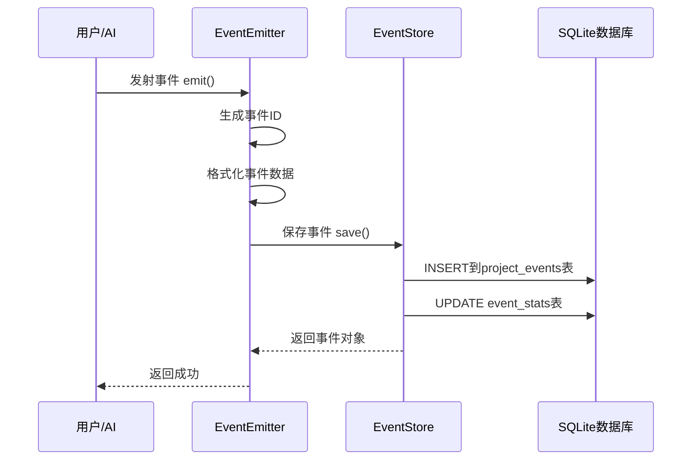
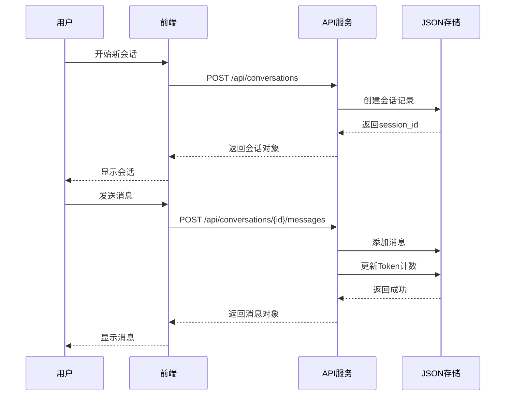

# 🎨 任务所·Flow v1.7 - UX设计手册：功能实现逻辑完整解析

**目标读者**: UX/UI设计师  
**文档目的**: 详细解析每个功能的后端实现逻辑，方便设计前端展示  
**生成时间**: 2025-11-19

---

## 📖 使用说明

**本文档结构**：

每个功能包含：
1. **功能概述** - 这个功能是什么
2. **实现逻辑** - 后端如何实现
3. **数据模型** - 输入输出数据结构
4. **API接口** - 如何调用后端
5. **业务流程** - 数据流转过程
6. **UX设计建议** - 前端如何展示（含交互流程、UI组件、布局）
7. **实施优先级** - P0/P1/P2

---

## 🎯 重点关注：3大核心系统（完全未展示）

---

# 📊 核心系统1：全局事件流系统

## 1.1 功能概述

**什么是事件流系统？**

事件流系统是整个任务所·Flow的"神经系统"，记录系统中发生的一切重要操作：
- 任务被创建/开始/完成
- 问题被发现/解决
- 决策被制定
- 架构师交接工作
- 等等...

**核心价值**：
- ✅ 可追溯性：任何操作都有记录，可以回溯
- ✅ 可视化：系统运行状态一目了然
- ✅ 审计：谁在什么时候做了什么
- ✅ 分析：统计数据帮助改进流程

---

## 1.2 实现逻辑

### 核心组件

```
EventEmitter（事件发射器）
    ↓
EventStore（事件存储器）
    ↓
SQLite数据库（3个表）
    ├─ project_events（事件主表）
    ├─ event_types（事件类型定义表）
    └─ event_stats（事件统计表）
```

### 工作流程



---

## 1.3 数据模型

### 事件对象（Event）

```json
{
  "id": "EVT-a1b2c3d4",              // 事件唯一ID
  "project_id": "TASKFLOW",          // 项目ID
  "event_type": "task.created",      // 事件类型（28种之一）
  "event_category": "task",          // 事件分类（task/issue/decision/deployment/system/general）
  "source": "ai",                    // 事件来源（system/user/ai/external）
  "actor": "AI Architect",           // 操作者
  "title": "任务创建: REQ-010-B",    // 事件标题
  "description": "新任务已创建...", // 事件描述
  "data": {                          // 事件数据（任意JSON）
    "task_id": "REQ-010-B",
    "priority": "P0",
    "estimated_hours": 3.0
  },
  "related_entity_type": "task",     // 关联实体类型
  "related_entity_id": "REQ-010-B",  // 关联实体ID
  "severity": "info",                // 严重性（info/warning/error/critical）
  "status": "processed",             // 事件状态（pending/processed/archived）
  "tags": ["task", "created"],       // 标签列表
  "occurred_at": "2025-11-19T10:30:00Z",  // 事件发生时间
  "created_at": "2025-11-19T10:30:01Z"    // 记录时间
}
```

### 28种事件类型

```javascript
// 任务生命周期（9种）
"TASK_CREATED"      // 任务创建
"TASK_ASSIGNED"     // 任务分配
"TASK_STARTED"      // 任务开始
"TASK_BLOCKED"      // 任务阻塞
"TASK_UNBLOCKED"    // 任务解除阻塞
"TASK_SUBMITTED"    // 任务提交审查
"TASK_REVIEWED"     // 任务审查完成
"TASK_COMPLETED"    // 任务完成
"TASK_CANCELLED"    // 任务取消

// 功能生命周期（5种）
"FEATURE_PROPOSED"      // 功能提案
"FEATURE_APPROVED"      // 功能批准
"FEATURE_IN_PROGRESS"   // 功能开发中
"FEATURE_COMPLETED"     // 功能完成
"FEATURE_DEPLOYED"      // 功能部署

// 问题生命周期（6种）
"ISSUE_DISCOVERED"   // 问题发现
"ISSUE_ASSIGNED"     // 问题分配
"ISSUE_IN_PROGRESS"  // 问题处理中
"ISSUE_SOLVED"       // 问题解决
"ISSUE_VERIFIED"     // 问题验证
"ISSUE_CLOSED"       // 问题关闭

// 协作事件（8种）
"ARCHITECT_HANDOVER"      // 架构师交接
"ARCHITECT_RESUME"        // 新架构师接管
"CODE_REVIEW_REQUESTED"   // 代码审查请求
"DECISION_RECORDED"       // 技术决策记录
"KNOWLEDGE_CAPTURED"      // 知识捕获
"DEPENDENCY_ADDED"        // 依赖添加
"MILESTONE_REACHED"       // 里程碑达成
"RISK_IDENTIFIED"         // 风险识别
```

### 事件统计数据

```json
{
  "project_id": "TASKFLOW",
  "total_events": 156,
  "task_events": 89,        // 任务相关事件
  "issue_events": 34,       // 问题相关事件
  "decision_events": 12,    // 决策相关事件
  "deployment_events": 5,   // 部署相关事件
  "system_events": 16,      // 系统相关事件
  "info_events": 120,       // info级别
  "warning_events": 25,     // warning级别
  "error_events": 8,        // error级别
  "critical_events": 3,     // critical级别
  "last_event_at": "2025-11-19T14:30:00Z",
  "last_updated": "2025-11-19T14:30:01Z"
}
```

---

## 1.4 API接口详解

### API 1: 发射事件

```http
POST /api/events
Content-Type: application/json

{
  "project_id": "TASKFLOW",
  "event_type": "task.created",
  "title": "任务创建: 实现事件系统",
  "description": "新任务 REQ-010-B 被创建",
  "category": "task",
  "source": "ai",
  "actor": "AI Architect",
  "severity": "info",
  "related_entity_type": "task",
  "related_entity_id": "REQ-010-B",
  "tags": ["task", "created"],
  "data": {
    "task_id": "REQ-010-B",
    "priority": "P0"
  }
}
```

**返回**：
```json
{
  "success": true,
  "event": { /* 完整事件对象 */ },
  "message": "Event emitted successfully"
}
```

### API 2: 查询事件列表（核心）

```http
GET /api/events?project_id=TASKFLOW&category=task&severity=warning&limit=50&offset=0
```

**查询参数**：
- `project_id` - 项目ID过滤
- `event_type` - 事件类型过滤
- `category` - 分类过滤（task/issue/decision/deployment/system）
- `severity` - 严重性过滤（info/warning/error/critical）
- `actor` - 操作者过滤
- `related_entity_type` - 关联实体类型过滤
- `related_entity_id` - 关联实体ID过滤
- `start_time` - 开始时间（ISO格式）
- `end_time` - 结束时间（ISO格式）
- `limit` - 返回数量（默认100，最大1000）
- `offset` - 偏移量（分页用）

**返回**：
```json
{
  "success": true,
  "events": [
    { /* 事件1 */ },
    { /* 事件2 */ },
    // ...
  ],
  "count": 50,
  "limit": 50,
  "offset": 0,
  "filters": { /* 使用的筛选条件 */ }
}
```

### API 3: 获取事件统计

```http
GET /api/events/stats/TASKFLOW
```

**返回**：
```json
{
  "success": true,
  "project_id": "TASKFLOW",
  "stats": {
    "total_events": 156,
    "task_events": 89,
    "issue_events": 34,
    // ... 完整统计数据
  }
}
```

### API 4-8：其他端点

- `GET /api/events/{event_id}` - 获取单个事件详情
- `POST /api/events/batch` - 批量发射事件
- `GET /api/events/types` - 获取事件类型列表
- `GET /api/events/by-entity/{type}/{id}` - 按实体查询事件
- `GET /api/events/health` - 健康检查

---

## 1.5 UX设计建议（核心）

### 页面布局设计

```
┌─────────────────────────────────────────────────────┐
│ 📊 事件流 - 任务所·Flow                              │
├─────────────────────────────────────────────────────┤
│                                                       │
│ ┌─────────────────────────────────────────────────┐ │
│ │  📈 事件统计面板                                  │ │
│ ├─────────────────────────────────────────────────┤ │
│ │  [总数: 156]  [任务: 89]  [问题: 34]  [决策: 12] │ │
│ │  [⚠️ Warning: 25]  [❌ Error: 8]  [🔴 Critical: 3]│ │
│ └─────────────────────────────────────────────────┘ │
│                                                       │
│ ┌─────────────────────────────────────────────────┐ │
│ │  🔍 筛选控件                                      │ │
│ ├─────────────────────────────────────────────────┤ │
│ │  [分类▼]  [严重性▼]  [操作者▼]  [日期范围]      │ │
│ │  [重置]  [应用筛选]                              │ │
│ └─────────────────────────────────────────────────┘ │
│                                                       │
│ ┌─────────────────────────────────────────────────┐ │
│ │  📋 事件列表（可滚动）                            │ │
│ ├─────────────────────────────────────────────────┤ │
│ │  🟢 INFO | 任务创建 | 2025-11-19 10:30           │ │
│ │  任务创建: REQ-010-B 实现事件系统                 │ │
│ │  👤 AI Architect | 📋 task | 🔗 REQ-010-B       │ │
│ │  [查看详情]                                      │ │
│ ├─────────────────────────────────────────────────┤ │
│ │  🟡 WARNING | 任务阻塞 | 2025-11-19 11:15        │ │
│ │  任务阻塞: INTEGRATE-003 等待依赖                │ │
│ │  👤 System | 📋 task | 🔗 INTEGRATE-003         │ │
│ │  [查看详情]                                      │ │
│ ├─────────────────────────────────────────────────┤ │
│ │  🔴 CRITICAL | 风险识别 | 2025-11-19 12:00       │ │
│ │  风险识别: SQLite并发限制可能导致锁表             │ │
│ │  👤 AI Architect | 🤝 collaboration            │ │
│ │  [查看详情]                                      │ │
│ └─────────────────────────────────────────────────┘ │
│                                                       │
│ ┌─────────────────────────────────────────────────┐ │
│ │  📄 分页控件                                      │ │
│ │  [上一页] 第1页/共10页 [下一页]                  │ │
│ └─────────────────────────────────────────────────┘ │
└─────────────────────────────────────────────────────┘
```

### 交互流程设计

#### 流程1：查看事件列表

```
用户进入页面
    ↓
前端调用：GET /api/events?project_id=TASKFLOW&limit=50&offset=0
    ↓
显示事件列表（每个事件显示：严重性图标、事件类型、标题、时间、操作者）
    ↓
用户点击"查看详情"
    ↓
前端调用：GET /api/events/{event_id}
    ↓
显示弹窗（完整事件信息，包括data字段的JSON数据）
```

#### 流程2：筛选事件

```
用户选择筛选条件
    ├─ 分类：任务/问题/决策/部署/系统
    ├─ 严重性：info/warning/error/critical
    ├─ 操作者：AI Architect / System / User
    └─ 日期范围：最近7天 / 最近30天 / 自定义
    ↓
用户点击"应用筛选"
    ↓
前端调用：GET /api/events?category=task&severity=warning&start_time=2025-11-18T00:00:00Z
    ↓
更新事件列表
```

#### 流程3：查看事件统计

```
页面加载时
    ↓
前端调用：GET /api/events/stats/TASKFLOW
    ↓
显示统计卡片：
    ├─ 总事件数（大数字）
    ├─ 按分类统计（饼图）
    ├─ 按严重性统计（柱状图）
    └─ 最后事件时间
```

#### 流程4：按实体查询事件

```
用户在任务详情页点击"查看事件"
    ↓
前端调用：GET /api/events/by-entity/task/REQ-010-B
    ↓
显示该任务的所有相关事件（时间线视图）
```

---

## 1.6 UI组件设计建议

### 组件1：事件卡片（EventCard）

**视觉设计**：
```
┌────────────────────────────────────────────┐
│ 🟢 INFO | 任务创建 | 2025-11-19 10:30    │ ← 标题栏
├────────────────────────────────────────────┤
│ 任务创建: REQ-010-B 实现事件系统            │ ← 事件标题
│                                            │
│ 新任务已创建，优先级P0，预估3小时           │ ← 描述
│                                            │
│ 👤 AI Architect                            │ ← 元信息
│ 📋 任务 | 🔗 REQ-010-B                     │
│ 🏷️ task, created, P0                      │ ← 标签
│                                            │
│ [查看详情] [查看关联]                       │ ← 操作按钮
└────────────────────────────────────────────┘
```

**颜色方案**：
- 🟢 INFO: 绿色边框/背景
- 🟡 WARNING: 黄色边框/背景
- 🟠 ERROR: 橙色边框/背景
- 🔴 CRITICAL: 红色边框/背景

### 组件2：事件统计面板（EventStatsPanel）

```
┌──────────────┬──────────────┬──────────────┬──────────────┐
│   总事件数   │   任务事件   │   问题事件   │   决策事件   │
│     156      │      89      │      34      │      12      │
│  ↑ +12 今天  │  ↑ +5 今天   │  ↓ -2 今天   │  → 0 今天    │
└──────────────┴──────────────┴──────────────┴──────────────┘

┌──────────────────────────────────────────────────────────┐
│  📊 事件分类分布（饼图）                                   │
│  ────────────────────────────────────────                │
│     任务: 57% ████████████                              │
│     问题: 22% █████                                     │
│     决策: 8%  ██                                        │
│     部署: 3%  █                                         │
│     系统: 10% ███                                       │
└──────────────────────────────────────────────────────────┘

┌──────────────────────────────────────────────────────────┐
│  ⚠️ 严重性分布（柱状图）                                   │
│  ────────────────────────────────────────                │
│     Info:     ████████████████████ 120 (77%)           │
│     Warning:  ██████ 25 (16%)                          │
│     Error:    ██ 8 (5%)                                │
│     Critical: █ 3 (2%)                                 │
└──────────────────────────────────────────────────────────┘
```

### 组件3：事件筛选器（EventFilter）

```
┌──────────────────────────────────────────────────────┐
│  🔍 筛选事件                                           │
├──────────────────────────────────────────────────────┤
│                                                        │
│  事件分类：                                            │
│  [✓] 任务  [✓] 问题  [ ] 决策  [✓] 部署  [ ] 系统    │
│                                                        │
│  严重性：                                              │
│  [✓] Info  [✓] Warning  [✓] Error  [✓] Critical      │
│                                                        │
│  操作者：                                              │
│  [下拉选择] ▼                                         │
│    - 全部                                             │
│    - AI Architect                                     │
│    - Full-stack Engineer                              │
│    - System                                           │
│    - User                                             │
│                                                        │
│  时间范围：                                            │
│  [最近7天 ▼]  或  [2025-11-18] 至 [2025-11-19]       │
│                                                        │
│  [重置筛选]  [应用筛选]                                │
└──────────────────────────────────────────────────────┘
```

### 组件4：事件详情弹窗（EventDetailModal）

```
┌──────────────────────────────────────────────────────┐
│  ✕ 事件详情                                          │
├──────────────────────────────────────────────────────┤
│                                                        │
│  🟡 WARNING | TASK_BLOCKED                           │
│                                                        │
│  标题：任务阻塞: INTEGRATE-003 等待依赖               │
│  描述：任务 INTEGRATE-003 因等待 REQ-006 完成而阻塞   │
│                                                        │
│  基本信息：                                            │
│  ├─ 事件ID：EVT-a1b2c3d4                             │
│  ├─ 项目：TASKFLOW                                   │
│  ├─ 分类：任务（task）                                │
│  ├─ 来源：系统（system）                              │
│  ├─ 操作者：System                                    │
│  ├─ 严重性：WARNING                                   │
│  ├─ 状态：已处理（processed）                         │
│  ├─ 发生时间：2025-11-19 11:15:23                    │
│  └─ 记录时间：2025-11-19 11:15:24                    │
│                                                        │
│  关联信息：                                            │
│  ├─ 实体类型：任务（task）                            │
│  └─ 实体ID：INTEGRATE-003                            │
│     [查看任务详情 →]                                  │
│                                                        │
│  事件数据（JSON）：                                    │
│  {                                                    │
│    "task_id": "INTEGRATE-003",                       │
│    "blocked_by": "REQ-006",                          │
│    "estimated_delay": "2h"                           │
│  }                                                    │
│                                                        │
│  标签：                                                │
│  [task] [blocked] [waiting]                          │
│                                                        │
│  [关闭]                                               │
└──────────────────────────────────────────────────────┘
```

### 组件5：事件时间线（EventTimeline）

**用于显示某个实体（如任务）的事件历史**：

```
┌──────────────────────────────────────────────────────┐
│  📅 任务 REQ-010-B 的事件时间线                       │
├──────────────────────────────────────────────────────┤
│                                                        │
│  2025-11-19 14:30 ●─────────────────────────┐       │
│                   │ TASK_COMPLETED          │       │
│                   │ 任务完成                 │       │
│                   │ 👤 Full-stack Engineer  │       │
│                   └─────────────────────────┘       │
│                                                        │
│  2025-11-19 11:45 ●─────────────────────────┐       │
│                   │ TASK_SUBMITTED          │       │
│                   │ 任务提交审查             │       │
│                   │ 👤 Full-stack Engineer  │       │
│                   └─────────────────────────┘       │
│                                                        │
│  2025-11-19 10:00 ●─────────────────────────┐       │
│                   │ TASK_STARTED            │       │
│                   │ 任务开始                 │       │
│                   │ 👤 Full-stack Engineer  │       │
│                   └─────────────────────────┘       │
│                                                        │
│  2025-11-18 22:30 ●─────────────────────────┐       │
│                   │ TASK_CREATED            │       │
│                   │ 任务创建                 │       │
│                   │ 👤 AI Architect         │       │
│                   └─────────────────────────┘       │
│                                                        │
└──────────────────────────────────────────────────────┘
```

---

## 1.7 前端实现代码示例

### JavaScript代码

```javascript
// ===== 事件流Dashboard主程序 =====

class EventStreamDashboard {
  constructor() {
    this.apiBase = 'http://localhost:8800';
    this.projectId = 'TASKFLOW';
    this.currentPage = 0;
    this.pageSize = 50;
    this.filters = {
      category: null,
      severity: null,
      actor: null,
      start_time: null,
      end_time: null
    };
  }

  // 初始化
  async init() {
    await this.loadStats();
    await this.loadEvents();
    this.setupEventListeners();
    this.startAutoRefresh();
  }

  // 加载统计数据
  async loadStats() {
    try {
      const response = await fetch(`${this.apiBase}/api/events/stats/${this.projectId}`);
      const data = await response.json();
      
      if (data.success) {
        this.renderStats(data.stats);
      }
    } catch (error) {
      console.error('加载统计失败:', error);
    }
  }

  // 加载事件列表
  async loadEvents() {
    try {
      // 构建查询参数
      const params = new URLSearchParams({
        project_id: this.projectId,
        limit: this.pageSize,
        offset: this.currentPage * this.pageSize
      });

      // 添加筛选条件
      if (this.filters.category) params.append('category', this.filters.category);
      if (this.filters.severity) params.append('severity', this.filters.severity);
      if (this.filters.actor) params.append('actor', this.filters.actor);
      if (this.filters.start_time) params.append('start_time', this.filters.start_time);
      if (this.filters.end_time) params.append('end_time', this.filters.end_time);

      const response = await fetch(`${this.apiBase}/api/events?${params}`);
      const data = await response.json();
      
      if (data.success) {
        this.renderEvents(data.events);
      }
    } catch (error) {
      console.error('加载事件失败:', error);
    }
  }

  // 渲染统计数据
  renderStats(stats) {
    document.getElementById('total-events').textContent = stats.total_events;
    document.getElementById('task-events').textContent = stats.task_events;
    document.getElementById('issue-events').textContent = stats.issue_events;
    document.getElementById('decision-events').textContent = stats.decision_events;
    document.getElementById('warning-events').textContent = stats.warning_events;
    document.getElementById('error-events').textContent = stats.error_events;
    document.getElementById('critical-events').textContent = stats.critical_events;

    // 绘制图表（使用Chart.js）
    this.renderPieChart(stats);
    this.renderBarChart(stats);
  }

  // 渲染事件列表
  renderEvents(events) {
    const container = document.getElementById('events-list');
    
    container.innerHTML = events.map(event => `
      <div class="event-card severity-${event.severity}" data-event-id="${event.id}">
        <div class="event-header">
          <span class="severity-badge ${event.severity}">
            ${this.getSeverityIcon(event.severity)} ${event.severity.toUpperCase()}
          </span>
          <span class="event-type">${event.event_type}</span>
          <span class="event-time">${this.formatTime(event.occurred_at)}</span>
        </div>
        
        <div class="event-title">${event.title}</div>
        
        ${event.description ? `<div class="event-description">${event.description}</div>` : ''}
        
        <div class="event-meta">
          <span class="actor">👤 ${event.actor || 'System'}</span>
          <span class="category">📋 ${event.event_category}</span>
          ${event.related_entity_id ? 
            `<span class="related">🔗 ${event.related_entity_id}</span>` : ''}
        </div>
        
        <div class="event-actions">
          <button onclick="dashboard.viewEventDetail('${event.id}')">查看详情</button>
          ${event.related_entity_id ? 
            `<button onclick="dashboard.viewRelatedEntity('${event.related_entity_type}', '${event.related_entity_id}')">
              查看关联
            </button>` : ''}
        </div>
      </div>
    `).join('');
  }

  // 查看事件详情
  async viewEventDetail(eventId) {
    try {
      const response = await fetch(`${this.apiBase}/api/events/${eventId}`);
      const data = await response.json();
      
      if (data.success) {
        this.showEventModal(data.event);
      }
    } catch (error) {
      console.error('获取事件详情失败:', error);
    }
  }

  // 显示事件详情弹窗
  showEventModal(event) {
    const modal = document.getElementById('event-modal');
    const content = document.getElementById('modal-content');
    
    content.innerHTML = `
      <div class="modal-header">
        <h3>${this.getSeverityIcon(event.severity)} ${event.event_type}</h3>
        <button class="close-btn" onclick="dashboard.closeModal()">✕</button>
      </div>
      
      <div class="modal-body">
        <div class="detail-section">
          <h4>标题</h4>
          <p>${event.title}</p>
        </div>
        
        ${event.description ? `
          <div class="detail-section">
            <h4>描述</h4>
            <p>${event.description}</p>
          </div>
        ` : ''}
        
        <div class="detail-section">
          <h4>基本信息</h4>
          <table class="detail-table">
            <tr><td>事件ID</td><td>${event.id}</td></tr>
            <tr><td>项目</td><td>${event.project_id}</td></tr>
            <tr><td>分类</td><td>${event.event_category}</td></tr>
            <tr><td>来源</td><td>${event.source}</td></tr>
            <tr><td>操作者</td><td>${event.actor || '-'}</td></tr>
            <tr><td>严重性</td><td>${event.severity}</td></tr>
            <tr><td>状态</td><td>${event.status}</td></tr>
            <tr><td>发生时间</td><td>${event.occurred_at}</td></tr>
          </table>
        </div>
        
        ${event.related_entity_id ? `
          <div class="detail-section">
            <h4>关联信息</h4>
            <p>实体类型：${event.related_entity_type}</p>
            <p>实体ID：<code>${event.related_entity_id}</code></p>
            <button onclick="dashboard.viewRelatedEntity('${event.related_entity_type}', '${event.related_entity_id}')">
              查看${event.related_entity_type}详情 →
            </button>
          </div>
        ` : ''}
        
        ${event.data ? `
          <div class="detail-section">
            <h4>事件数据</h4>
            <pre class="json-data">${JSON.stringify(event.data, null, 2)}</pre>
          </div>
        ` : ''}
        
        ${event.tags && event.tags.length > 0 ? `
          <div class="detail-section">
            <h4>标签</h4>
            <div class="tags">
              ${event.tags.map(tag => `<span class="tag">${tag}</span>`).join('')}
            </div>
          </div>
        ` : ''}
      </div>
    `;
    
    modal.style.display = 'block';
  }

  // 辅助函数
  getSeverityIcon(severity) {
    const icons = {
      'info': '🟢',
      'warning': '🟡',
      'error': '🟠',
      'critical': '🔴'
    };
    return icons[severity] || '⚪';
  }

  formatTime(isoString) {
    const date = new Date(isoString);
    const now = new Date();
    const diffMs = now - date;
    const diffMins = Math.floor(diffMs / 60000);
    
    if (diffMins < 1) return '刚刚';
    if (diffMins < 60) return `${diffMins}分钟前`;
    if (diffMins < 1440) return `${Math.floor(diffMins/60)}小时前`;
    return date.toLocaleString('zh-CN');
  }

  // 自动刷新
  startAutoRefresh() {
    setInterval(() => {
      this.loadEvents();
      this.loadStats();
    }, 30000); // 每30秒刷新
  }
}

// 初始化
const dashboard = new EventStreamDashboard();
document.addEventListener('DOMContentLoaded', () => {
  dashboard.init();
});
```

---

## 1.8 实施优先级

**优先级**：🔴 P0（最高优先级）  
**工时估算**：6-8小时  
**价值评分**：⭐⭐⭐⭐⭐  
**实施建议**：立即实施，本周完成

**原因**：
- 事件系统是整个系统的核心基础设施
- 可追溯性是企业级系统的必备功能
- 用户急需了解系统运行状态
- 实施后用户体验提升最明显

---

# 💬 核心系统2：对话历史库

## 2.1 功能概述

**什么是对话历史库？**

对话历史库记录了用户与AI的所有对话会话，包括：
- 会话元信息（标题、时间、状态）
- 消息历史（用户提问、AI回答）
- Token消耗统计
- 会话标签和分类
- 会话摘要

**核心价值**：
- ✅ 知识沉淀：重要对话可以回顾
- ✅ Token管理：追踪Token消耗
- ✅ 优化提示词：分析哪些对话更高效
- ✅ 团队协作：多人可以查看对话历史

---

## 2.2 实现逻辑

### 数据存储

```
conversations（会话表）
    ├─ session_id: 会话ID
    ├─ title: 会话标题
    ├─ created_at: 创建时间
    ├─ updated_at: 更新时间
    ├─ status: 状态（active/completed/archived）
    ├─ total_tokens: 总Token消耗
    ├─ messages_count: 消息数
    ├─ participants: 参与者列表
    ├─ tags: 标签列表
    ├─ summary: 会话摘要
    └─ messages: 消息列表（嵌套）
```

### 工作流程



---

## 2.3 数据模型

### 会话对象（Conversation）

```json
{
  "session_id": "session-001",
  "title": "Dashboard重构讨论",
  "created_at": "2025-11-18 22:30:00",
  "updated_at": "2025-11-18 23:45:00",
  "status": "completed",
  "total_tokens": 25000,
  "messages_count": 6,
  "participants": ["用户", "架构师AI"],
  "tags": ["Dashboard", "重构", "UI"],
  "summary": "讨论了Dashboard的重构方案，决定采用模块化设计",
  "messages": [
    { /* 消息1 */ },
    { /* 消息2 */ }
  ]
}
```

### 消息对象（Message）

```json
{
  "id": "msg-001",
  "timestamp": "2025-11-18 22:30:15",
  "from": "用户",
  "content": "请分析当前Dashboard的架构问题",
  "type": "request",
  "tokens": 50
}
```

### 会话统计

```json
{
  "total_sessions": 5,
  "active_sessions": 2,
  "completed_sessions": 3,
  "archived_sessions": 0,
  "total_messages": 50,
  "total_tokens": 100000,
  "average_tokens_per_session": 20000,
  "average_messages_per_session": 10
}
```

---

## 2.4 API接口详解

### API 1: 获取所有会话

```http
GET /api/conversations
```

**返回**：
```json
{
  "success": true,
  "sessions": [
    { /* 会话1 */ },
    { /* 会话2 */ }
  ],
  "count": 5
}
```

### API 2: 获取会话详情

```http
GET /api/conversations/{session_id}
```

**返回**：
```json
{
  "success": true,
  "session": {
    "session_id": "session-001",
    "title": "...",
    "messages": [
      { /* 消息1 */ },
      { /* 消息2 */ }
    ],
    // ...
  }
}
```

### API 3: 创建新会话

```http
POST /api/conversations
Content-Type: application/json

{
  "title": "新会话标题",
  "participants": ["用户", "架构师AI"],
  "tags": ["Dashboard", "UI"],
  "summary": "会话摘要"
}
```

### API 4-12：其他端点

- `PUT /api/conversations/{session_id}` - 更新会话
- `DELETE /api/conversations/{session_id}` - 删除会话
- `POST /api/conversations/{id}/messages` - 添加消息
- `GET /api/conversations/{id}/messages` - 获取消息列表
- `GET /api/conversations/tags/list` - 获取标签列表
- `GET /api/conversations/stats/overview` - 获取统计
- `GET /api/conversations/search/by-date` - 按日期查询
- `GET /api/conversations/search/by-tokens` - 按Token查询
- `GET /api/conversations/health` - 健康检查

---

## 2.5 UX设计建议

### 页面布局设计

```
┌──────────────────────────────────────────────────────────┐
│  💬 对话历史库 - 任务所·Flow                              │
├──────────────────────────────────────────────────────────┤
│                                                            │
│  ┌─────────────────────────────────────────────────────┐ │
│  │  📊 会话统计                                          │ │
│  ├─────────────────────────────────────────────────────┤ │
│  │  [总会话: 5] [活跃: 2] [已完成: 3] [总Token: 100K]  │ │
│  │  [平均Token/会话: 20K] [平均消息/会话: 10条]         │ │
│  └─────────────────────────────────────────────────────┘ │
│                                                            │
│  ┌─────────────────────────────────────────────────────┐ │
│  │  🔍 搜索和筛选                                        │ │
│  ├─────────────────────────────────────────────────────┤ │
│  │  [搜索框] [状态▼] [标签▼] [日期范围] [Token范围]    │ │
│  │  [创建新会话+]                                       │ │
│  └─────────────────────────────────────────────────────┘ │
│                                                            │
│  ┌─────────────────────────────────────────────────────┐ │
│  │  📝 会话列表                                          │ │
│  ├─────────────────────────────────────────────────────┤ │
│  │  ┌──────────────────────────────────────────────┐  │ │
│  │  │ session-001 | Dashboard重构讨论               │  │ │
│  │  │ 🟢 已完成 | 2025-11-18 22:30                 │  │ │
│  │  ├──────────────────────────────────────────────┤  │ │
│  │  │ 💬 6条消息 | 🔢 25,000 tokens               │  │ │
│  │  │ 🏷️ Dashboard, 重构, UI                      │  │ │
│  │  │ 📝 讨论了Dashboard的重构方案...              │  │ │
│  │  ├──────────────────────────────────────────────┤  │ │
│  │  │ [查看详情] [继续对话] [导出] [删除]          │  │ │
│  │  └──────────────────────────────────────────────┘  │ │
│  │                                                      │ │
│  │  ┌──────────────────────────────────────────────┐  │ │
│  │  │ session-002 | API集成讨论                     │  │ │
│  │  │ 🟡 活跃中 | 2025-11-19 10:00                 │  │ │
│  │  ├──────────────────────────────────────────────┤  │ │
│  │  │ 💬 12条消息 | 🔢 45,000 tokens              │  │ │
│  │  │ 🏷️ API, 集成, 测试                          │  │ │
│  │  │ 📝 正在讨论如何集成各个API模块...             │  │ │
│  │  ├──────────────────────────────────────────────┤  │ │
│  │  │ [查看详情] [继续对话] [归档]                 │  │ │
│  │  └──────────────────────────────────────────────┘  │ │
│  └─────────────────────────────────────────────────────┘ │
└──────────────────────────────────────────────────────────┘
```

### 会话详情页布局

```
┌──────────────────────────────────────────────────────────┐
│  ← 返回列表 | session-001: Dashboard重构讨论              │
├──────────────────────────────────────────────────────────┤
│                                                            │
│  会话信息：                                                │
│  ├─ 状态：🟢 已完成                                       │
│  ├─ 创建：2025-11-18 22:30                               │
│  ├─ 更新：2025-11-18 23:45                               │
│  ├─ 参与者：用户、架构师AI                                │
│  ├─ 标签：Dashboard, 重构, UI                             │
│  └─ Token：25,000 / 6条消息                              │
│                                                            │
│  会话摘要：                                                │
│  讨论了Dashboard的重构方案，决定采用模块化设计...         │
│                                                            │
│  ━━━━━━━━━━━━━━━━━━━━━━━━━━━━━━━━━━━━━━━━━━━         │
│                                                            │
│  💬 消息历史（6条）：                                      │
│                                                            │
│  ┌──────────────────────────────────────────────────┐   │
│  │  👤 用户 | 2025-11-18 22:30 | 50 tokens          │   │
│  │  ─────────────────────────────────────────────    │   │
│  │  请分析当前Dashboard的架构问题                    │   │
│  └──────────────────────────────────────────────────┘   │
│                                                            │
│  ┌──────────────────────────────────────────────────┐   │
│  │  🤖 架构师AI | 2025-11-18 22:32 | 8,500 tokens   │   │
│  │  ─────────────────────────────────────────────    │   │
│  │  我分析了Dashboard的代码，发现以下问题：           │   │
│  │  1. 模块耦合度高                                  │   │
│  │  2. 缺少统一的状态管理                            │   │
│  │  3. Tab切换逻辑分散                               │   │
│  │  ...                                              │   │
│  └──────────────────────────────────────────────────┘   │
│                                                            │
│  ┌──────────────────────────────────────────────────┐   │
│  │  👤 用户 | 2025-11-18 22:35 | 30 tokens          │   │
│  │  ─────────────────────────────────────────────    │   │
│  │  请给出重构建议                                    │   │
│  └──────────────────────────────────────────────────┘   │
│                                                            │
│  ... 更多消息 ...                                          │
│                                                            │
└──────────────────────────────────────────────────────────┘
```

### UI组件设计

#### 组件1：会话卡片（SessionCard）

```
┌─────────────────────────────────────────────────┐
│  session-001 | Dashboard重构讨论                │ ← 标题
│  🟢 已完成 | 2025-11-18 22:30                  │ ← 状态和时间
├─────────────────────────────────────────────────┤
│  💬 6条消息 | 🔢 25,000 tokens                 │ ← 统计信息
│  🏷️ Dashboard, 重构, UI                        │ ← 标签
│  📝 讨论了Dashboard的重构方案，决定采用...       │ ← 摘要
├─────────────────────────────────────────────────┤
│  [查看详情] [继续对话] [导出] [删除]            │ ← 操作按钮
└─────────────────────────────────────────────────┘
```

**颜色方案**：
- 🟢 active（活跃）: 绿色
- 🟡 completed（已完成）: 灰色
- 🔵 archived（已归档）: 蓝色

#### 组件2：消息气泡（MessageBubble）

```
用户消息（右对齐）：
        ┌──────────────────────────────┐
        │ 请分析Dashboard的架构问题     │
        │                              │
        │ 👤 用户 | 22:30 | 50 tokens  │
        └──────────────────────────────┘

AI消息（左对齐）：
┌──────────────────────────────────────┐
│ 我分析了代码，发现以下问题：         │
│ 1. 模块耦合度高                      │
│ 2. 缺少统一状态管理                  │
│ ...                                  │
│                                      │
│ 🤖 架构师AI | 22:32 | 8,500 tokens  │
└──────────────────────────────────────┘
```

#### 组件3：会话统计面板（SessionStatsPanel）

```
┌─────────────┬─────────────┬─────────────┬─────────────┐
│  总会话数   │  活跃会话   │  已完成     │  总Token    │
│     5       │     2       │     3       │   100,000   │
└─────────────┴─────────────┴─────────────┴─────────────┘

Token消耗趋势（折线图）：
   ↑
40K│              ●
30K│           ●     ●
20K│        ●           ●
10K│     ●
   └──────────────────────────→
     11/15  11/16  11/17  11/18  11/19
```

---

## 2.6 前端实现代码示例

```javascript
// ===== 对话历史Dashboard =====

class ConversationDashboard {
  constructor() {
    this.apiBase = 'http://localhost:8800';
    this.currentSessionId = null;
  }

  // 初始化
  async init() {
    await this.loadStats();
    await this.loadSessions();
    this.setupEventListeners();
  }

  // 加载统计
  async loadStats() {
    const response = await fetch(`${this.apiBase}/api/conversations/stats/overview`);
    const data = await response.json();
    
    if (data.success) {
      this.renderStats(data.stats);
    }
  }

  // 加载会话列表
  async loadSessions() {
    const response = await fetch(`${this.apiBase}/api/conversations`);
    const data = await response.json();
    
    if (data.success) {
      this.renderSessions(data.sessions);
    }
  }

  // 渲染会话列表
  renderSessions(sessions) {
    const container = document.getElementById('sessions-list');
    
    container.innerHTML = sessions.map(session => `
      <div class="session-card" onclick="convDashboard.viewSession('${session.session_id}')">
        <div class="session-header">
          <h4>${session.title}</h4>
          <span class="status-badge ${session.status}">${this.getStatusText(session.status)}</span>
        </div>
        
        <div class="session-time">
          ${this.formatTime(session.created_at)}
        </div>
        
        <div class="session-stats">
          <span>💬 ${session.messages_count} 条消息</span>
          <span>🔢 ${session.total_tokens.toLocaleString()} tokens</span>
        </div>
        
        ${session.tags && session.tags.length > 0 ? `
          <div class="session-tags">
            🏷️ ${session.tags.map(tag => `<span class="tag">${tag}</span>`).join(' ')}
          </div>
        ` : ''}
        
        ${session.summary ? `
          <div class="session-summary">
            📝 ${session.summary}
          </div>
        ` : ''}
        
        <div class="session-actions">
          <button onclick="event.stopPropagation(); convDashboard.continueSession('${session.session_id}')">
            继续对话
          </button>
          <button onclick="event.stopPropagation(); convDashboard.exportSession('${session.session_id}')">
            导出
          </button>
          <button onclick="event.stopPropagation(); convDashboard.deleteSession('${session.session_id}')">
            删除
          </button>
        </div>
      </div>
    `).join('');
  }

  // 查看会话详情
  async viewSession(sessionId) {
    this.currentSessionId = sessionId;
    
    // 获取消息列表
    const response = await fetch(`${this.apiBase}/api/conversations/${sessionId}/messages`);
    const data = await response.json();
    
    if (data.success) {
      this.showSessionDetail(sessionId, data.messages);
    }
  }

  // 显示会话详情
  showSessionDetail(sessionId, messages) {
    // 隐藏会话列表，显示详情页
    document.getElementById('sessions-list-view').style.display = 'none';
    document.getElementById('session-detail-view').style.display = 'block';
    
    // 渲染消息
    const container = document.getElementById('messages-container');
    container.innerHTML = messages.map(msg => `
      <div class="message-bubble ${msg.from === '用户' ? 'user' : 'ai'}">
        <div class="message-header">
          <span class="sender">${msg.from === '用户' ? '👤' : '🤖'} ${msg.from}</span>
          <span class="time">${msg.timestamp}</span>
          <span class="tokens">🔢 ${msg.tokens.toLocaleString()} tokens</span>
        </div>
        <div class="message-content">
          ${this.formatMessageContent(msg.content)}
        </div>
      </div>
    `).join('');
    
    // 滚动到底部
    container.scrollTop = container.scrollHeight;
  }

  // 格式化消息内容（支持Markdown）
  formatMessageContent(content) {
    // 简单的Markdown渲染（可以使用marked.js）
    return content
      .replace(/\*\*(.*?)\*\*/g, '<strong>$1</strong>')
      .replace(/\*(.*?)\*/g, '<em>$1</em>')
      .replace(/`(.*?)`/g, '<code>$1</code>')
      .replace(/\n/g, '<br>');
  }

  // 辅助函数
  getStatusText(status) {
    const texts = {
      'active': '🟢 活跃',
      'completed': '🟡 已完成',
      'archived': '🔵 已归档'
    };
    return texts[status] || status;
  }

  formatTime(timeStr) {
    const date = new Date(timeStr);
    return date.toLocaleString('zh-CN');
  }
}

// 初始化
const convDashboard = new ConversationDashboard();
document.addEventListener('DOMContentLoaded', () => {
  convDashboard.init();
});
```

---

## 2.7 交互流程详解

### 流程1：浏览会话列表